# DocQuery 🔍

**Chat with any OpenAPI specification using RAG - no context window limits, no hallucinations, source-grounded answers.**

---


---

https://github.com/user-attachments/assets/84bf04d7-2583-4fc6-b5a4-e2d8bdf2a7c2

## Why This Project Matters

The standard advice for understanding an API is "just paste the spec into ChatGPT." That breaks down fast.

| Problem | DocQuery's Solution |
|---|---|
| Stripe's spec is ~50,000 lines - won't fit in any context window | RAG retrieves only the relevant chunks per query |
| Internal/private APIs can't be pasted into public LLMs | Fully local vector store, nothing leaves your machine |
| LLM training data has a cutoff - new endpoints are unknown | Re-ingest any time, answers always reflect the current spec |
| Raw LLM answers can't cite where they got the answer | Every response includes the exact source endpoints |
| Can't query multiple APIs simultaneously | Multi-spec support with per-spec ChromaDB collections |

---

## Features

- **RAG pipeline** - OpenAPI spec is chunked, embedded with `all-mpnet-base-v2`, and stored in ChromaDB alongside a BM25 index; each query runs dense and keyword retrieval in parallel, fuses them with Reciprocal Rank Fusion (RRF), then re-ranks candidates with a cross-encoder before hitting the LLM.
- **`$ref` resolution** - request body schemas are fully dereferenced at ingest time, including `allOf`, `anyOf`, and `oneOf` composition patterns (up to 6 levels deep), so field names like `name` are semantically searchable.
- **Confidence scoring** - a hybrid of Vectara's HHEM hallucination model (70%) and cosine similarity (30%), with a JSON field grounding check blended into the HHEM score. Falls back to cosine-only if HHEM is unavailable.
- **Source citations** - every answer includes the exact HTTP method + path that grounded it
- **Multi-spec support** - ingest multiple APIs simultaneously and switch between them with one click
- **Dual ingest modes** - paste a public URL or upload a local `.json` file (for private/internal specs)
- **Persistent vector store** - ChromaDB and BM25 indexes persist to disk; specs survive restarts without re-ingestion.
- **Voice input** - record a question via the browser's MediaRecorder API; audio is transcribed by Whisper via Groq (~1s) and populated into the query box automatically.

---

## Architecture



---

## Design Decisions

**Summary-first chunking** - Each chunk starts with `{summary} - {METHOD} {path}` before the technical details. The sentence transformer sees the human-readable description first, which dramatically improves retrieval for natural language queries over path-only chunking. Synonym expansion is also injected into each chunk so keyword queries hit the right endpoints.

**`$ref` resolution at ingest time** - OpenAPI specs use `$ref` pointers for all request/response schemas. Without resolving them, chunks contain `#/components/schemas/User` instead of the actual field names (`name`, `password`). The resolver handles `allOf`, `anyOf`, and `oneOf` composition up to 6 levels deep, so nested schemas are fully searchable.

**Hybrid BM25 + dense retrieval with RRF** - Dense embeddings capture semantic similarity; BM25 catches exact keyword matches (endpoint paths, parameter names). Reciprocal Rank Fusion combines both ranked lists into a single candidate set without needing a tuned interpolation weight. A cross-encoder then re-ranks the fused top-N for precision before the prompt is built.

**BM25 + RRF over HyDE** - HyDE generates a hypothetical answer to use as a proxy query, which helps when queries are vague and documents are unstructured prose. API documentation is the opposite: queries are specific ("how do I update a customer") and documents are structured chunks with exact method+path identifiers. In that setting HyDE introduces hallucination risk at the retrieval stage - a fabricated answer may embed closer to the wrong endpoint than the right one. BM25 handles this domain more reliably: "update a customer" is a near-exact keyword match to `Update a customer — PATCH /v1/customers/{customer}`, whereas a dense-only retriever can rank it far lower because the embedding model doesn't bridge synonyms like "modify" → "update" at query time. Running both in parallel and fusing with RRF captures keyword precision and semantic recall without the hallucination risk HyDE introduces at retrieval.

**HHEM + cosine confidence scoring** - Vectara's Hallucination Evaluation Model (HHEM) scores factual consistency between the answer prose and retrieved chunks. A separate JSON field grounding check verifies that any code examples in the answer use only field names present in the spec. The two signals are blended (70/30) and combined with cosine similarity as a fallback, giving a 0–100 score that acts as a metric for detecting hallucinations.

**Per-spec ChromaDB collections + BM25 indexes** - Each ingested API gets its own ChromaDB collection and a paired `.pkl` BM25 index on disk. This allows simultaneous multi-spec support with zero cross-contamination and O(1) collection switching.

**Dual ingest modes** - URL ingest for public specs, file upload for private/internal APIs that can't be sent to external services. Both paths converge at the same `extract_chunks()` function.

**Llama 3.1 8B over Zephyr 7B** - Zephyr consistently ignored strict prompt rules and hallucinated parameters not in the spec. Llama 3.1 follows instruction constraints reliably enough for production-quality answers on API documentation tasks.

**`all-mpnet-base-v2` over `all-MiniLM-L6-v2`** - MiniLM-L6 is faster but uses a distilled attention mechanism. API documentation chunks pack a summary, HTTP method, path, parameters, and schema fields into a single block; mpnet's full attention across the whole sequence produces more accurate embeddings for these dense, structured inputs. The trade-off - larger model, slower encode - is negligible in practice since embedding happens once at ingest and query embedding is a single short string.

---

## Quick Start

### Prerequisites

- Python 3.11+
- React.js 18+
- A free [HuggingFace token](https://huggingface.co/settings/tokens)  (for the LLM)
- A free [Groq API key](https://console.groq.com) (for voice transcription)

### Backend

Clone the repository:

```bash
git clone https://github.com/superb-striker/DocQuery
cd DocQuery
```

Create a virtual environment and install required libraries:

```bash
python -m venv venv
source venv/bin/activate        # Windows: venv\Scripts\activate
pip install -r requirements.txt
```

Create `.env`:

```env
HF_TOKEN=your_token_here
GROQ_API_KEY=your_groq_key_here
```

Start the backend server:

```bash
uvicorn main:app --reload
# API running at http://localhost:8000
# Swagger docs at http://localhost:8000/docs
```

Install required packages and start the frontend server:

### Frontend

```bash
cd frontend
npm install
npm run dev
# UI running at http://localhost:5173
```

---

## API Reference

### `POST /ingest`

Fetch and index an OpenAPI spec from a public URL.

**Request**

```json
{
  "specification_url": "https://petstore3.swagger.io/api/v3/openapi.json"
}
```

**Response**

```json
{
  "specification_name": "Swagger Petstore - OpenAPI 3.0",
  "chunks_stored": 19,
  "message": "Successfully ingested 19 endpoints."
}
```

---

### `POST /ingest/file`

Upload a local `.json` spec file (for private/internal APIs).

**Request**

```
file: <your-openapi-spec.json>
```

**Response** - same as `/ingest`

---

### `POST /query`

Ask a question against an ingested spec.

**Request**

```json
{
  "question": "How do I create a secret with a view notification?",
  "specification_name": "phantom_share"
}
```

**Response**

```json
{
  "answer": "Use POST /api/secrets with notify_on_view: true and provide a notify_email...",
  "confidence": 87,
  "sources": [
    {
      "endpoint": "POST /api/secrets",
      "summary": "Create Secret"
    }
  ]
}
```

---

### `POST /transcribe`

Transcribe a browser audio recording to text via Groq Whisper, for use as a query.

**Request**

```json
file: <recording.webm>
```

**Response**

```json
{
  "transcript": "How do I authenticate with the API?"
}
```

---

### `GET /specifications`

List all currently ingested specification names.

**Response**

```json
{
  "specifications": ["swagger_petstore__openapi_30", "phantom_share"]
}
```

---

## Local Development

### Project Structure

```markdown
DocQuery/
└── backend/
|   ├── main.py     
|   ├── ingest.py             
|   ├── vectorStore.py 
|   ├── llm.py            
|   ├── confidence.py     
|   ├── loggerConfig.py       
|   ├── chromaDB/       
|   ├── bm25_indexes/ 
├── .env            
└── frontend/
    ├── DocQuery.jsx      
    ├── main.jsx          
    ├── src/
        ├── theme.js      
        ├── utils/
        │   └── classifyError.js
        ├── hooks/
        |   └── useTypewriter.js
        └── components/
            ├── ui/ 
            |   ├── ErrorBanner.jsx
            |   ├── Badge.jsx
            |   ├── NoiseFilter.jsx
            |   ├── Spinner.jsx
            |   ├── ThemeToggle.jsx
            ├── AppHeader.jsx
            ├── ConfidenceRing.jsx
            ├── SourceChip.jsx
            ├── IngestPanel.jsx
            ├── QueryPanel.jsx
            └── ResultPanel.jsx
```

### Environment Variables

| Variable | Required | Description |
|---|---|---|
| `HF_TOKEN` | Yes | HuggingFace access token for the inference router |
| `GROQ_API_KEY` | Yes | Groq API key for Whisper voice transcription |

### Changing the LLM

The model is set in `llm.py`. Any model available on the [HuggingFace router](https://huggingface.co/docs/inference-providers) works as a drop-in replacement.

### Resetting the Vector Store

```bash
# Wipe all ingested specs and start fresh
rm -rf chromaDB/ bm25_indexes/                     # Linux/Mac
Remove-Item -Recurse -Force chromaDB, bm25_indexes # Windows PowerShell
```

---

## Limitations

- **HuggingFace free tier** - rate limited to the LLM; responses may take 5–15 seconds under load. For faster LLM responses, swap to Groq in `llm.py`.
- **Schema depth** - `$ref` resolution is capped at 6 levels. Deeply nested `$ref` chains beyond that are not resolved.
- **YAML specs** - only JSON OpenAPI specs are supported. For YAML specs, convert first: `python -c "import yaml,json,sys; json.dump(yaml.safe_load(open('spec.yaml')), open('spec.json','w'))"`.
- **HHEM model load time** - the Vectara hallucination model is loaded at startup and adds a few seconds to cold start.

---
